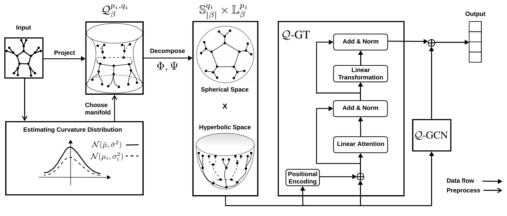

## 1. Overview

This is the Pytorch implementation for "Pseudo-Riemannian Graph Transformer (NeurIPS 2025)"

Authors: Quan Le, Cuong Ta



## 2. Setup

### 2.1 Environment
`pip install -r requirements.txt`

### 2.2 Datasets
The data folder is `./data/node_classification/`.

For Cora, Citeseer, Pubmed, Airport, we get the data from Hypformer [repo](https://github.com/Graph-and-Geometric-Learning/hyperbolic-transformer.git).

For Arxiv, Products and Vessel, we use ogbn library to install. Run the command in `examples/run_nc.sh` and `examples/run_lp.sh` to create.

For Penn94, we get the data from this [repo](https://github.com/CUAI/Non-Homophily-Large-Scale.git). Please set up the dataset in the data folder following this structure:
    - Create `./data/node_classification/fb100/`
    - Add `./data/node_classification/fb100/Penn94.mat`
    - Add `./data/node_classification/fb100/splits/fb100-Penn94-splits.npy`

For twitch_gamers, please install the data from this [link](https://snap.stanford.edu/data/twitch_gamers.html), and set up following this structure:
    - Create `./data/node_classification/twitch_gamer/`
    - Change the file name `large_twitch_edges.csv` to `twitch_gamer_edges.csv` 
    - Change the file name `large_twitch_features.csv` to `twitch_gamer_features.csv` 
    - Add `./data/node_classification/twitch_gamer/twitch_gamer_edges.csv`
    - Add `./data/node_classification/twitch_gamer/twitch_gamer_features.csv`
    - Take the file `.../splits/twitch-gamer-splits.npy` from this [repo](https://github.com/CUAI/Non-Homophily-Large-Scale.git)
    - Add `./data/node_classification/twitch_gamer/splits/twitch-gamer-splits.npy`

For Tree-1, Tree-2, Tree-3 datasets, please run the command in `examples/run_lp.sh` to create these.

## 3. Experiments
3.0 Go to the script at first.

```cd ./script```

3.1 To run QGT and baselines: please see the files `examples/run_nc.sh` and `examples/run_lp.sh` for node classification and link prediction tasks.

3.2 Seed 
- Seeds that we use: 1234, 1192, 1000.

3.3 Dataset
- Dataset choices: cora, citeseer, pubmed, airport, ogbn-arxiv, ogbn-products, ogbl-vessel, fb100, twitch_gamer, tree1, tree2, tree3.

3-4 Configuration
- Please see the file `config.py` for your customization.